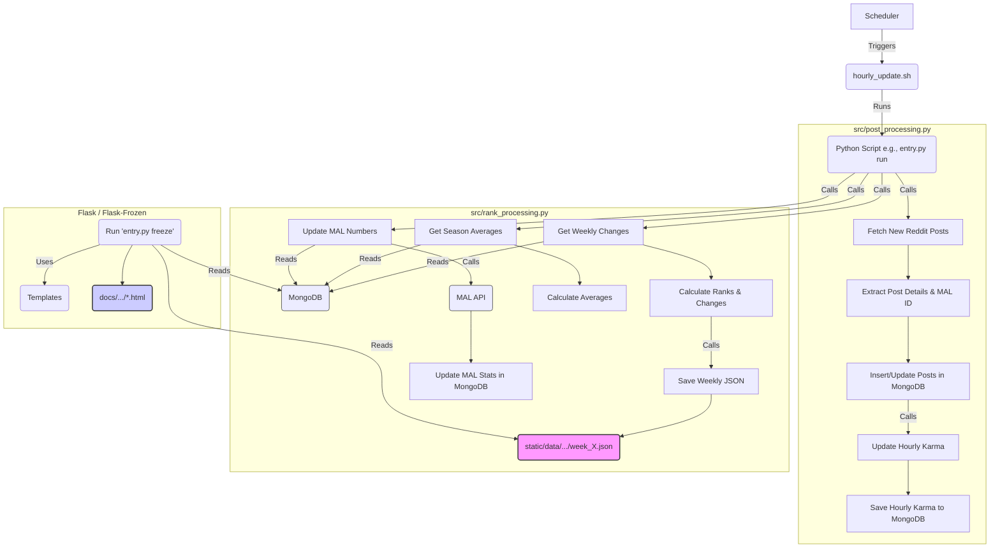

# Anime Karma Rankings & Discussion Automation 

## Overview

The **Anime Karma Rankings** is a full-stack Python project designed to process and rank anime-related discussion posts from Reddit. It leverages the Reddit API (via PRAW), MongoDB, and external data sources (like MyAnimeList) to:

- Retrieve and process Reddit discussions made within a 48-hour window.
- Calculate weekly changes, rank shifts, and karma differences.
- Generate static pages for the current season using Flask Frozen.
- Deploy static pages to Github Pages.

This project was created to automate the tracking and ranking of anime discussions made on r/anime, a half a decade tradition, which historically was made by hand by members of the community.

## Features

- **Reddit Post Processing:**  
  Extract posts from a specified Reddit user within a 48-hour window and schedule post processing.

- **Dynamic Ranking System:**  
  Calculate weekly rankings and karma changes using MongoDB data.  
  Example functions: `get_weekly_change()`, `assign_rank()`, and `get_season_averages()`.

- **MyAnimeList Integration:**  
  Fetch statistics from MyAnimeList (MAL) via the JIKAN API with calls to update rankings with additional metadata.

- **Flask Web Application:**  
  - Dynamic endpoints for the current week (`/`) and the current chart (`/current_chart.html`).
  - Render weekly anime ranking pages and static assets using Flask Frozen for deployment on github pages.

- **Data Persistence:**  
  - MongoDB is used to store detailed post information and hourly progression data.

- **Extensive Logging & Error Handling:**  
  Robust logging configured across different modules for easier debugging and historical analysis.

## Backend Process Flow

The following diagram illustrates the core backend process for fetching, processing, and ranking data:

## Recommended Projects & Resources

- **Animetrics**
    - A defuncted project that automatically tracked and created the charts posted on r/anime, which was one of the first initiatives to automate the process. The code is now open source and can be found below.
    - [GitHub Repo](https://github.com/ShaneIsrael/animetrics)
- **Anime Karma Charts**
    - The most advanced available site for viewing the ranks from r/anime discussions, with the main difference being that it doesn't have the 48-hour window cut off for discussions to be tracked, so shows will be updated regardless of when they were posted.
    - [Site](https://animekarmalist.com/)
- **r/anime GitHub**
    - The GitHub repo for the r/anime mod team, which contains many applications and resources for the community, including the season data used in this project to align the titles in the database with the ones used on reddit.
    - [GitHub Repo](https://github.com/r-anime/holo)